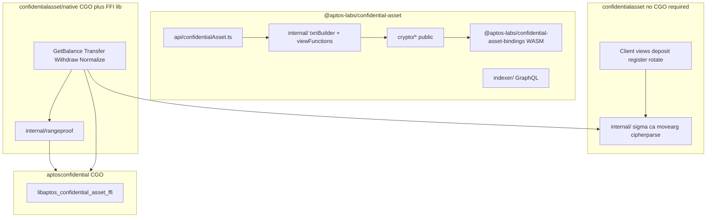

<!--
ts_package: @aptos-labs/confidential-asset
ts_src_root: aptos-ts-sdk/confidential-asset/src/
go_module: github.com/aptos-labs/aptos-go-sdk/v2/confidentialasset
go_native: github.com/aptos-labs/aptos-go-sdk/v2/confidentialasset/native
last_reviewed: 2026-05-19
-->

# TypeScript ↔ Go confidential asset mapping

This document maps **`@aptos-labs/confidential-asset`** (TypeScript) to **`github.com/aptos-labs/aptos-go-sdk/v2/confidentialasset`** (Go). Use it when porting features, debugging proof bytes, or choosing which Go package to import.

**Related:** Move view/entry argument layouts are in [SPEC.md](SPEC.md) (not duplicated here).

---

## How to use this doc

| Task | Read |
|------|------|
| “Where is TS file X in Go?” | [Directory mapping](#directory-mapping) |
| “What is the Go equivalent of TS method Y?” | [Public API mapping](#public-api-mapping) |
| “Do I need CGO?” | [Architecture](#architecture-overview) — anything in `native` requires CGO + FFI |
| “Why does proof/decrypt differ?” | [Crypto and FFI pipeline](#crypto-and-ffi-pipeline) |
| “What is intentionally missing?” | [Parity gaps](#parity-gaps-roadmap) |

**Maintenance:** When adding or changing a TS `ConfidentialAsset` method or Move entry, update this file and [SPEC.md](SPEC.md) if arguments change.

---

## Architecture overview

TypeScript ships one npm package with **public** `crypto/*` exports. Go splits **CGO-free** chain helpers from **FFI-backed** decrypt and range-proof transactions.



| Layer | TypeScript | Go |
|-------|------------|-----|
| User-facing client | `ConfidentialAsset` class | `confidentialasset.Client` + optional `native.Wrap(client)` |
| Transaction result | `CommittedTransactionResponse` (submit in class) | `*aptos.Transaction` (caller submits; helpers use `SubmitWithSimulatedGas`) |
| Low-level crypto | Exported from `crypto/` | `internal/*` only (not importable outside module) |
| Range proof + DLP | WASM bindings | CGO `aptosconfidential` static library |

---

## Directory mapping

TS paths are relative to **`aptos-ts-sdk/confidential-asset/src/`**.  
Go paths are relative to **`aptos-go-sdk/v2/confidentialasset/`**.

### API and internal

| TS path | Go path | Notes |
|---------|---------|-------|
| `api/confidentialAsset.ts` | `client.go`, `views.go`, `txsubmit.go`, `native/*.go` | TS builds + submits; Go mostly returns unsigned/simulated tx |
| `internal/confidentialAssetTxnBuilder.ts` | `client_proofs.go`, `native/proofs.go`, `txsubmit.go` | Entry payloads + gas simulation |
| `internal/viewFunctions.ts` | `views.go`, `balance_common.go`, `native/balance.go` | `getBalance` decrypt lives in Go `native` |
| `internal/index.ts` | (split above) | Re-exports builder + views |
| `consts.ts` | `consts.go` | Module name, chunk counts |
| `utils.ts`, `utils/memoize.ts` | `helpers.go` | Go has no balance/EK memoization cache |
| `indexer/*` | `indexer.go` | Go: stub only |

### Crypto (TS `crypto/` → Go `internal/`)

| TS path | Go path | Notes |
|---------|---------|-------|
| `crypto/twistedEd25519.ts` | `internal/caed25519/`, `helpers.go`, `TwistedDecryptionKey32` in `balance_common.go` | Go can derive twisted key from Ed25519 `SignMessage` |
| `crypto/twistedElGamal.ts` | `internal/ca/elgamal.go`, `internal/ca/points.go`, decrypt in `native/balance.go` | TS `solveDiscreteLog` via WASM; Go `aptosconfidential.Solver` |
| `crypto/chunkedAmount.ts` | `internal/ca/chunked.go` | 16-bit chunks |
| `crypto/encryptedAmount.ts` | `internal/ca/encrypted.go` | `EncryptedAmount`, transfer amount helpers |
| `crypto/ristrettoPoint.ts` | `github.com/gtank/ristretto255` | No separate Go wrapper package |
| `crypto/sigmaProtocol.ts` | `internal/sigma/prove.go`, `fiat_shamir.go` | Core prover |
| `crypto/sigmaProtocolRegistration.ts` | `internal/sigma/registration.go` | |
| `crypto/sigmaProtocolWithdraw.ts` | `internal/sigma/withdraw.go` | |
| `crypto/sigmaProtocolTransfer.ts` | `internal/sigma/transfer.go` | |
| `crypto/confidentialNormalization.ts` | `native/proofs.go` (`NormalizeBalance`) | + range proof via FFI |
| `crypto/confidentialWithdraw.ts` | `native/proofs.go` (`Withdraw`) | |
| `crypto/confidentialTransfer.ts` | `native/proofs.go` (`Transfer`) | |
| `crypto/confidentialKeyRotation.ts` | `client_proofs.go` (`RotateEncryptionKey`) | Pure Go sigma; no range proof |
| `crypto/bsgs.ts` | — | **Not ported**; Go uses Rust Solver only |
| `crypto/index.ts` | (see rows above) | TS re-exports all crypto publicly |

### Go-only internal helpers

| Go path | Role |
|---------|------|
| `internal/movearg/` | BCS shapes for Move entry args (`vector<u8>`, etc.) |
| `internal/sigbcs/` | Low-level BCS append for sigma |
| `internal/cipherparse/` | Parse view JSON `{P,R}` cipher chunks |
| `internal/rangeproof/` | `BatchRangeProof` → `aptosconfidential` (CGO only) |

**Removed placeholders (do not recreate):** `internal/crypto/` and `internal/prover/` were empty planning dirs; implementation is in `internal/ca` and `internal/sigma` / `internal/rangeproof`.

---

## Public API mapping

`ConfidentialAsset` (TS) ↔ Go types.  
**CGO:** `no` = root package only; `yes` = import `confidentialasset/native` and build with FFI.

| TS (`ConfidentialAsset` or export) | Go symbol | Package | CGO | Status |
|-----------------------------------|-----------|---------|-----|--------|
| `constructor` / module address | `NewClient`, `WithModuleAddress` | `confidentialasset` | no | parity |
| `withFeePayer` | `WithFeePayer` | `confidentialasset` | no | parity (submit path must set fee payer on tx) |
| `getBalance` | `(*native.Client).GetBalance` | `native` | yes | parity; returns `*ConfidentialBalance` (octas) |
| `registerBalance` | `(*Client).RegisterBalance` | `confidentialasset` | no | parity (sigma only) |
| `deposit` | `(*Client).Deposit` | `confidentialasset` | no | partial — TS optional `recipient`; Go no recipient arg |
| `withdraw` | `(*native.Client).Withdraw` | `native` | yes | parity (single tx) |
| `withdrawWithTotalBalance` | — | — | — | **not implemented** (no auto rollover orchestration) |
| `transfer` | `(*native.Client).Transfer` | `native` | yes | partial — TS `memo` / extra auditor keys; Go memo internal only |
| `transferWithTotalBalance` | — | — | — | **not implemented** |
| `normalizeBalance` | `(*native.Client).NormalizeBalance` | `native` | yes | parity |
| `rolloverPendingBalance` | `(*Client).RolloverPendingBalance` | `confidentialasset` | no | partial — TS may submit normalize first; use `native.NewConfidentialAsset` + `RolloverPendingBalance` for normalize-then-rollover |
| `rotateEncryptionKey` | `(*Client).RotateEncryptionKey` | `confidentialasset` | no | parity (sigma only) |
| `hasUserRegistered` | `(*Client).HasUserRegistered` | `confidentialasset` | no | parity (`has_confidential_store` view) |
| `isBalanceNormalized` | `(*Client).IsBalanceNormalized` | `confidentialasset` | no | parity |
| `isIncomingTransfersPaused` | `(*Client).IncomingTransfersPaused` | `confidentialasset` | no | parity |
| `isEmergencyPaused` | `(*Client).IsEmergencyPaused` | `confidentialasset` | no | parity |
| `getEncryptionKey` | `(*Client).GetEncryptionKeyHex` | `confidentialasset` | no | parity (hex string) |
| `getEffectiveAuditorHint` | `(*Client).GetEffectiveAuditorHint` | `confidentialasset` | no | parity (structured struct vs TS types) |
| `getAssetAuditorEncryptionKey` | `(*Client).GetEffectiveAuditorEncryptionKeyHex` | `confidentialasset` | no | rough parity (naming differs) |
| `getActivities` / indexer | `(*Client).GetActivities` | `confidentialasset` | no | **stub** (`ErrIndexerNotImplemented`) |
| (builder) max memo | `(*Client).GetMaxMemoBytes` | `confidentialasset` | no | parity |
| — | `(*Client).FetchBalanceCipherChunks` | `confidentialasset` | no | Go extra (raw C/D from view, no decrypt) |
| — | `(*Client).FetchPublicFABalanceOctas` | `confidentialasset` | no | Go extra (gas budgeting for FA APT) |
| — | `(*Client).SubmitWithSimulatedGas` | `confidentialasset` | no | Go extra |
| — | `(*Client).ChainID` | `confidentialasset` | no | parity (sigma domain) |
| — | `native.Wrap`, `native.NewConfidentialAsset` | `native` | yes | Go-specific entry to FFI client |

### TS-only public crypto exports

These are **importable in TS** from `@aptos-labs/confidential-asset` but **not exposed in Go** (use `internal/` or `native` instead):

- `TwistedEd25519PrivateKey`, `TwistedElGamal`, `EncryptedAmount`, `ConfidentialNormalization`, etc.
- `createBsgsTable`, `BsgsSolver` — no Go equivalent.

---

## Crypto and FFI pipeline

| Concern | TypeScript | Go |
|---------|------------|-----|
| Sigma proofs | `crypto/sigmaProtocol*.ts` + `confidential*.ts` | `internal/sigma` + `client_proofs.go` / `native/proofs.go` |
| Batch range proof | `batchRangeProof` from `@aptos-labs/confidential-asset-bindings` | `internal/rangeproof` → `aptosconfidential.BatchRangeProof` |
| Verify (tests/tools) | `batchVerifyProof` | bindings tests; `native/smoke_test.go` golden round-trip |
| Decrypt chunk (16/32 bit) | `solveDiscreteLog` (WASM) | `aptosconfidential.Solver.Solve` in `native/balance.go` |
| Pedersen bases | In TS crypto code | `internal/ca` (`BaseG`, `HRistretto`) |
| BSGS pure TS | `crypto/bsgs.ts` | **Not implemented** |

### FFI smoke (tests only)

- **Not** a public Go API.
- CGO CI: `go test -short ./confidentialasset/native/...` runs `TestFFILinkedAndSolverConstructs` and `TestBatchRangeProofGoldenRoundTrip` in `native/smoke_test.go`.
- Env `SKIP_CONFIDENTIAL_BINDINGS=1` skips those tests.

### Building the FFI library (Go)

See [confidential-asset-bindings `bindings/go/README.md`](https://github.com/aptos-labs/confidential-asset-bindings/blob/main/bindings/go/README.md):  
`cargo build -p aptos_confidential_asset_ffi --release`  
Local dev often uses `replace` in `v2/go.mod` to a sibling bindings checkout.

---

## Move alignment

View and entry function names, argument ordering, and cipher JSON shape: **[SPEC.md](SPEC.md)**.

---

## Parity gaps (roadmap)

| Gap | TS | Go |
|-----|----|----|
| Indexer activities | Full GraphQL | `GetActivities` stub |
| Multi-tx orchestration | `withdrawWithTotalBalance`, `transferWithTotalBalance` | Single `Withdraw` / `Transfer` only |
| Deposit recipient | Optional third-party deposit | Signer-only deposit |
| Transfer memo | Supported | `transferWithMemo` exists but **not exported** |
| Extra auditor encryption keys | Transfer API | Effective auditor path only |
| Response caching | `memoize` for balance/EK | None |
| Public crypto types | Exported | Hidden under `internal/` |
| Submit helper | Class submits and returns committed tx | Returns `*aptos.Transaction`; caller signs/submits |
| Examples | Many flows in one package | See `v2/examples/confidential_asset/` |

---

## Import cheat sheet

```go
import (
    aptos "github.com/aptos-labs/aptos-go-sdk/v2"
    "github.com/aptos-labs/aptos-go-sdk/v2/confidentialasset"
    "github.com/aptos-labs/aptos-go-sdk/v2/confidentialasset/native"
)

client, _ := aptos.NewClient(aptos.Testnet)
base := confidentialasset.NewClient(client,
    confidentialasset.WithRESTBaseURL("https://fullnode.testnet.aptoslabs.com/v1"),
)

// No CGO
ok, _ := base.HasUserRegistered(ctx, account, token)

// CGO + libaptos_confidential_asset_ffi
nc := native.Wrap(base)
bal, err := nc.GetBalance(ctx, acct, token, twistedHex)
```

Importing `native` with `CGO_ENABLED=0` fails at compile time (`build constraints exclude all Go files`).

---

## Examples

| Example (`v2/examples/confidential_asset/`) | CGO | TS analogue |
|---------------------------------------------|-----|-------------|
| `register/` | no | `registerBalance` + optional deposit |
| `balance/` | yes | `getBalance` |
| `transfer/` | yes | `transfer` |
| `withdraw/` | yes | `withdraw` |
| `deposit_chain/` | yes | deposit + normalize + rollover + balance |

See [examples/confidential_asset/README.md](../../examples/confidential_asset/README.md).
